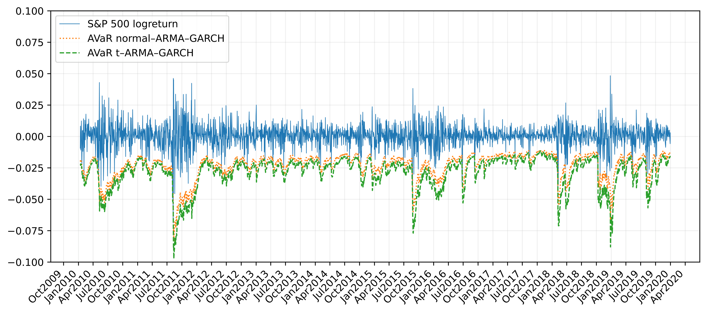

# Heavy-Tailed Risk Forecasting with (ARMA)–GARCH: VaR and Expected Shortfall

## Overview

Financial returns exhibit heavy tails, volatility clustering, and extreme events that violate Gaussian assumptions. Risk models based on Normal innovations systematically underestimate extreme losses, leading to inaccurate Value-at-Risk (VaR) and Expected Shortfall (AVaR) forecasts.

This project implements and evaluates volatility-based risk models on S&P 500 returns using:

- Constant Volatility (CV)
- GARCH(1,1)
- ARMA(1,1)–GARCH(1,1)

under both:

- Gaussian innovations
- Student-t innovations

Models are evaluated using rigorous statistical backtests and distributional diagnostics.

---

## Key Results

### Heavy-tailed models improve tail risk estimation

Statistical goodness-of-fit tests demonstrate that Gaussian innovations are rejected, while Student-t innovations significantly improve tail modelling.

| Model | Distribution | KS Test | Anderson-Darling | Interpretation |
|------|-------------|---------|------------------|----------------|
| CV | Normal | Rejected | Rejected | Poor fit |
| CV | Student-t | Improved | Improved | Better tail representation |
| GARCH | Normal | Rejected | Rejected | Underestimates risk |
| GARCH | Student-t | Accepted / Improved | Improved | More realistic model |

---

### Student-t models improve VaR calibration

Christoffersen likelihood ratio backtests show improved calibration using Student-t innovations.

| Model | Horizon | Distribution | Coverage Test | Independence Test | Conditional Coverage |
|------|--------|-------------|--------------|-------------------|---------------------|
| ARMA-GARCH | Short horizon | Normal | Often rejected | Often rejected | Poor |
| ARMA-GARCH | Short horizon | Student-t | Improved | Improved | Better |
| ARMA-GARCH | Long horizon | Both | Mixed | Mixed | Degrades |

---

### Expected Shortfall captures extreme risk more accurately

## AVaR Forecast Comparison

The Student-t ARMA-GARCH model produces consistently larger (more conservative) Expected Shortfall estimates during volatile periods, reflecting improved modelling of extreme losses.

---

## Methodology

### Data

- Asset: S&P 500 Index
- Frequency: Daily log returns
- Source: Yahoo Finance

Returns computed as:

r_t = log(P_t / P_{t-1})

---

### Models Implemented

Constant Volatility:
r_t = μ + ε_t

GARCH(1,1):
σ_t² = ω + α ε_{t-1}² + β σ_{t-1}²

ARMA(1,1)-GARCH(1,1):
r_t = μ + φ r_{t-1} + θ ε_{t-1} + ε_t

ε_t = σ_t z_t

Innovations follow:

- Normal distribution
- Student-t distribution

---

## Risk Measures

Value-at-Risk:
VaR_α = μ_t + σ_t F^{-1}(α)

Expected Shortfall:
ES_α = E[r_t | r_t < VaR_α]

Expected Shortfall captures magnitude of extreme losses beyond VaR.

---

## Model Validation

Diagnostics performed:

- Probability Integral Transform (PIT)
- Kolmogorov-Smirnov test
- Anderson-Darling test
- Christoffersen coverage tests
- Berkowitz likelihood ratio test

---

## Repository Structure

.
├── README.md  
├── notebooks/  
├── report/  
├── src/  
├── assets/  
│   └── avar_comparison.png  
├── requirements.txt  

---

## Technologies Used

Python, NumPy, pandas, SciPy, arch, matplotlib, yfinance

---

## How to Run

pip install -r requirements.txt

Run notebook in notebooks directory.

---

## Financial Implications

This project demonstrates:

- Gaussian models underestimate extreme risk
- Heavy-tailed models improve forecast accuracy
- Expected Shortfall better captures tail severity
- Distribution assumptions materially affect risk estimates

---

## Future Improvements

- Tempered stable distributions
- Regime-switching models
- Rolling estimation windows
- Multivariate risk modelling

---

## References

Kim et al. (2011)  
Time series analysis for financial market meltdowns  
Journal of Banking & Finance

---

## Author

Neil Tamhankar  
Master of Financial Mathematics — Monash University  
Quantitative Finance | Risk Modelling
